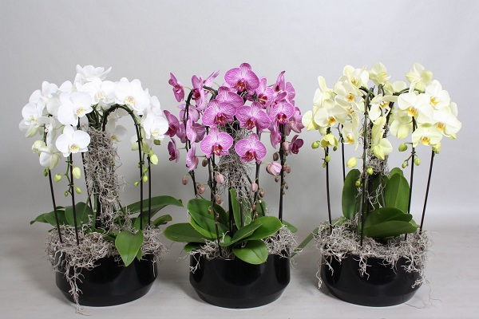
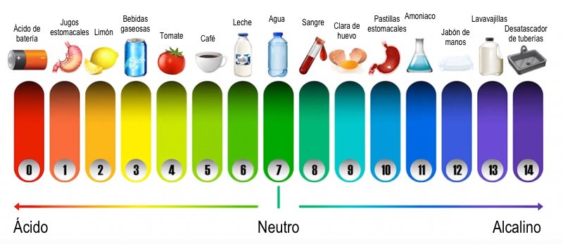
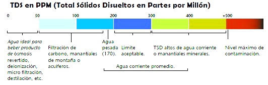
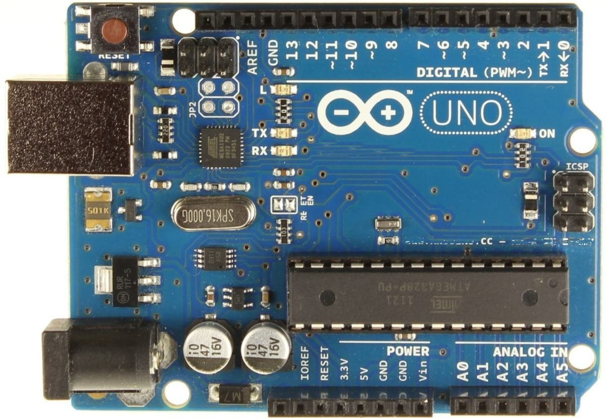
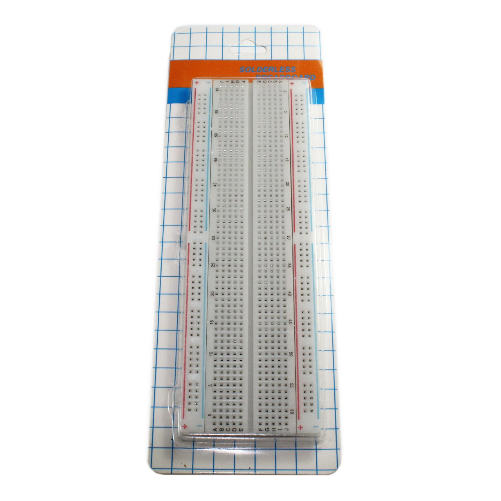
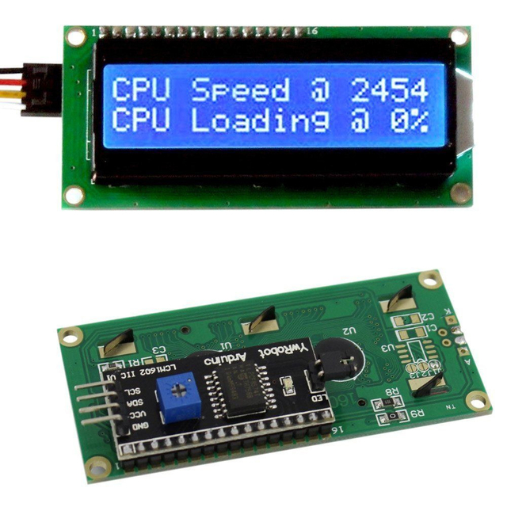
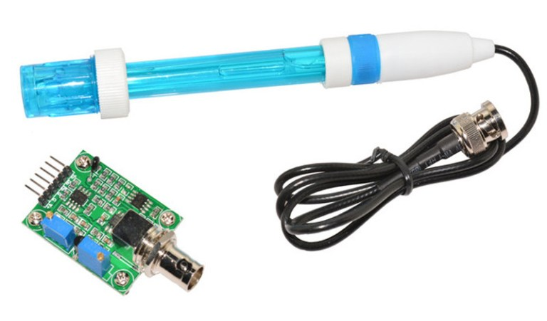
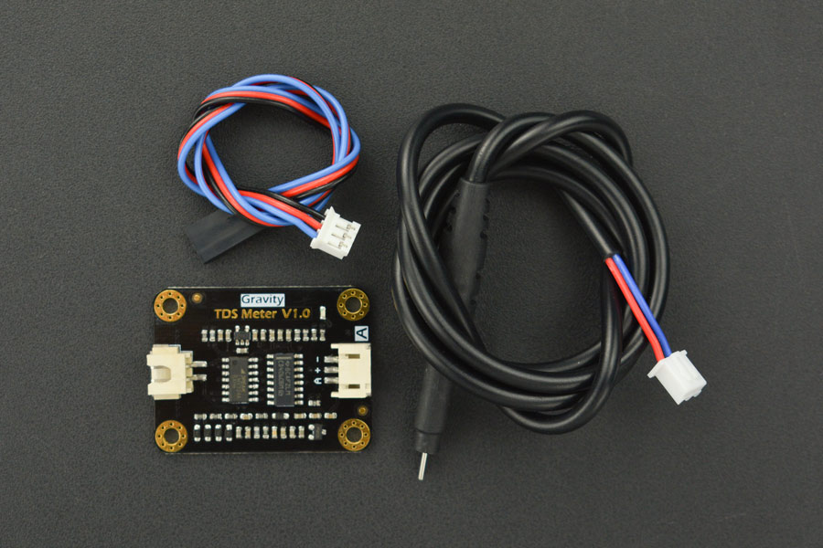

  

# Intro

Este es un proyecto de arduino que brinda dos soluciones distintas para poder utilizar y sensar PH y TDS en el agua.

La primera solucion utiliza solo codigo C que es grabado en el firmware del arduino. Esta solucion hace uso de una pantalla lcd para mostrar el sensado de la data.

La segunda es con  la utilizacion de Johnny-five y electron como container web, lo cual permite poder sensar y ver el resultado del senso en una aplicacion desktop.

# Motivacion

  

En la fauna, hay varias plantas que evolucionaron para que sus condiciones de crecimiento ideales esten adaptadas al lugar nativo en el que reciden.

Las orquideas, para poner un ejemplo, son plantas que en la naturaleza acostumbran a crecer sobre materia orcanica originada por los restos de otras plantas o organismos. Este tipo de materia organica es altamente acida, y las orquideas evolucionaron para que sus raices puedan crecer de la forma mas plenta y efectiva en este medio.

Para este tipo de plantas, si uno desea criarlas fuera  su habitat natural, es imperativo poder reproducir o por lo menos simular el habitat en el cual es natural para ellas crecer y florecer, para ello, dos de los factores mas importantes que hay que tener en cuenta en el agua que le brindamos a estas plantas son el grado de acidez o alcainidad (pH le vamos a decir de ahora en mas)  y su grado de mineralizacion  (TDS).

## Por que es el PH importante para las plantas?

El pH (pondus Hydrogenii) indica la acidez o alcalinidad de una solución liquida. El valor del pH varía, por norma general, entre 0 y 14. Una solución con un valor de pH de 0 a 7 es ácida y una con un valor de 7 a 14 es alcalina. 

  

La acidez influye substancialmente en la capacidad de absorción y solubilidad de numerosos elementos nutritivos. No solo eso,  El pH también repercute en el modo en que los elementos nutritivos, metales pesados y pesticidas son eliminados del suelo.

## Por que es el TDS importante para las plantas?

Los sólidos totales disueltos, también conocidos como TDS, son compuestos inorgánicos que se encuentran en el agua, como sales, metales pesados ​​y algunos rastros de compuestos orgánicos que se disuelven en el agua. Es decir, la cantidad de nutrientes en una solucion liquida.

PPM o Partes Por Millón es la unidad que se utiliza para medir el TDS.

  

Ahora, por que es importante tener en cuenta esta magnitud para las plantas?

Por que si el PPM encontrado en el agua que le subministramos a las plantas es elevado, los sistemas de raíces de las plantas no llegan a poder absorber toda la cantidad de minerales con los que encuentran y se pueden terminar quemando.
Si el PPM es mas bajo del ideal para ese tipo de planta, no va a tener suficientes minerales para poder crecer de forma optima.

## Fuentes
- https://maherelectronica.com/que-es-el-ph-del-agua/#:~:text=El%20pH%20del%20agua%20nos,considerada%20como%20la%20medida%20neutra.
- http://www.canna.es/importancia_acidez_del_ph_para_tus_plantas
- https://aguapuraysana.com/tds-que-importancia-tiene-y-como-medirlo/
- https://www.groho.es/post/ph-y-el-tds-afectan-la-calidad-del-agua

# Arduino Coneccion

  

## Sensor de PH 

Fuente: https://scidle.com/es/como-usar-un-sensor-de-ph-con-arduino/

El sensor de PH tiene 6 pines:
- V+ : Alimentación (5V)
- G :  Tierra de Alimentación
- G :  Tierra del circuito analógico
- Po: Valor de Ph en V
- Do:  Señal del límite de pH
- To : Temperatura

Para este proyecto solo vamos a utilizar los pines V+ G, G y Po.

El Pin V+ Se conecta al 5V del arduino.
Los dos pin G se conectan a cualquier GND del arduino.
El pin Po se conecta a la entrada (A0) del arduino.

## Sensor de TDS

Fuente: https://wiki.dfrobot.com/Gravity__Analog_TDS_Sensor___Meter_For_Arduino_SKU__SEN0244

El sensor de TDS tiene 3 pines:
- "+" : Alimentacion (5V)
- "-" : Tierra
- A : Valor de Phh en V

La alimentacion "+" va al 5V del arduino.
El pin de "-" va a cualquier GND del arduino.
El pin "A" va a la entrada (A1)  del arduino.

## Pantalla LCD

Fuente: https://www.naylampmechatronics.com/blog/35_Tutorial--LCD-con-I2C-controla-un-LCD-con-so.html

La pantalla LCD tiene 4 pines:

- GND: tierra
- VCC: Alimentacion (5V)
- SDA: Pin Analogico
- SCL: Pin Analogico

GND va a cualquier GND del arduino.
VCC va a la alimentacion 5V del arduino.
SDA va conectado en la entrada (A4) del arduino.
SCL va conectado en la entrada (A5) del arduino.

# Instalacion

## Con pantalla LCD

- Abrir el IDE de Arduino e importar el archivo "ArduinoPhMeterSerial.ino"
- Descargar Libreria de LiquidCrystal_I2C: https://codeload.github.com/marcoschwartz/LiquidCrystal_I2C/zip/master
- Descargar libreria de GravityTDS: https://codeload.github.com/DFRobot/GravityTDS/zip/master
- Instalar ambas librerias: https://www.arduino.cc/en/Guide/Libraries#.UxU8mdzF9H0
- Hacer click en el boton de "Upload" en el IDE de arduino.

## Con Cliente Web

- Abrir el IDE de Arduino y subir FirmataStandard como programa al firmware. Para ello Ir a: File> Examples > Firmata > StandardFirmata
- Una vez con Firmata subido en el arduino, Correr el comando **npm install** parado sobre la carpeta donde se haya descargado el repositorio
- Una vez instaladas las dependencias, correr la aplicacion con  **npm start** 

# Posibles Mejoras a futuro y sugerencias

- Idealmente un paso mas adelante seria tambien la uitlizacion de React en el cliente web.
- Poder Prender o apagar la salida de cualquiera de los dos sensores para que no entren en conflicto si se utilizan en el mismo liquido.

# Materiales Utilizados

  

- Placa Arduino UNO

  

- 1 Protoboard 830 puntos

  

- 1 Display LCD 1602

  

- logo_phsensor v1.1
- PH Electrode E201-BNC

  

- TDS Meter v1.0 DFRobot
